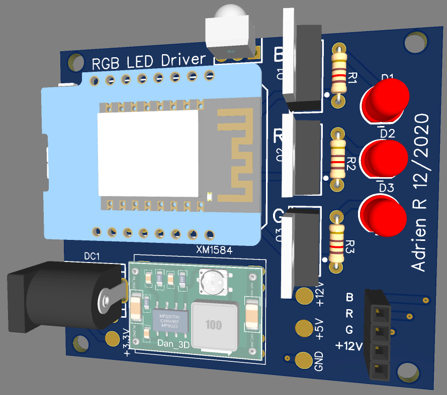
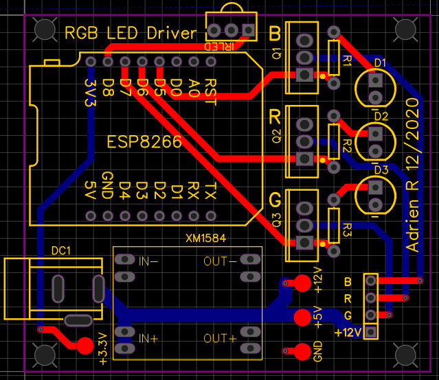

# RGB LED controller

This is a DIY version of a LED controller. It is used to control RGB 12V LED Strips.

It supports the Infrared remote control as well as a web interface with esp8266.

## Hardware

### Component list

- wemos D1 mini
- 3x 1k resistor
- 3x 5mm LED
- DC barrel jack
- XM2584 5V buck converter
- 3x IRLB8721 N-Type mosfets (https://cdn-shop.adafruit.com/datasheets/irlb8721pbf.pdf)
- tso 4830 IR LED (https://www.vishay.com/docs/82459/tsop48.pdf)

### basic wireing diagram 

source : https://learn.adafruit.com/rgb-led-strips/usage

### PCB Design

the pcb is a 2 layer board, designe in easy EDA

All the PCB files (Gerbers & easyEDA) are in the `hardware` folder.

## Software

The software is arduino made with platform.io

**SOFTWARE IS UNDER CONSTRUCTION**